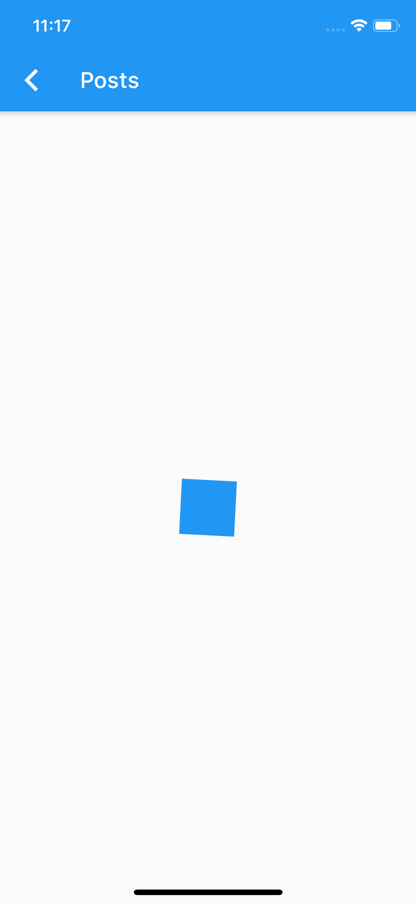

# Networking Demo

A Flutter project that demonstrates how to use the http package to make online requets.
It makes requests to the JsonPlaceholder online APIs.

# 📸 Screenshots

### The screenshots below are taken on a iOS simulator.

| Home Screen                                 | Loading Indicator                         |
| ------------------------------------------- | ----------------------------------------- |
|  |  |

|  Album and Photo Screen                | Photos of each album Screen                    |
| ------------------------------------------- | ----------------------------------------- |
|  |  |

| Post and Comment Screen                | Comments of each posts Screen                  |
| ------------------------------------------- | ----------------------------------------- |
|  |  |

|  User and Album Screen                      | Albums of each user Screen                |
| ------------------------------------------- | ----------------------------------------- |
|  |  |

|  User and Todo Screen                       | Todos of each user Screen                 |
| ------------------------------------------- | ----------------------------------------- |
|  |  |

## Getting Started

This project is a starting point for a Flutter application.

A few resources to get you started if this is your first Flutter project:

- [Lab: Write your first Flutter app](https://flutter.dev/docs/get-started/codelab)
- [Cookbook: Useful Flutter samples](https://flutter.dev/docs/cookbook)

For help getting started with Flutter, view our
[online documentation](https://flutter.dev/docs), which offers tutorials,
samples, guidance on mobile development, and a full API reference.
